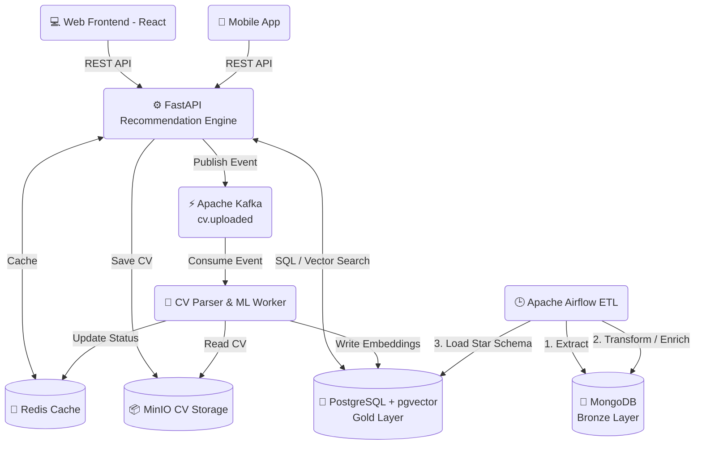

# 🚀 FindJob — Intelligent Job Recommendation & Aggregation Platform

<div align="center">
  
  
  <h3>🎓 Final Engineering Project / Capstone</h3>

  [](https://www.python.org/)
  [](https://fastapi.tiangolo.com/)
  [](https://reactjs.org/)
  [](https://www.docker.com/)
  [](https://github.com/pgvector/pgvector)
  [](https://redis.io/)
  [](https://kafka.apache.org/)
  [](https://airflow.apache.org/)

  **An AI-powered job intelligence platform that matches candidates with opportunities using semantic search, hybrid scoring, and automated CV analysis. It aggregates and enriches job listings from multiple sources across France and Morocco.**
</div>

---

## 📖 Table of Contents
1. [🌟 Project Overview](#-project-overview)
2. [💡 Key Innovations](#-key-innovations)
3. [🏗️ System Architecture](#-system-architecture)
4. [🧠 Recommendation Engine (AI Core)](#-recommendation-engine-ai-core)
5. [📊 Data Pipeline & BI Dashboard](#-data-pipeline--bi-dashboard)
6. [🚀 Quick Start & Deployment](#-quick-start--deployment)
7. [⚙️ API Reference](#-api-reference)
8. [👨‍💻 Author & Contact](#-author--contact)

---

## 🌟 Project Overview

**FindJob** is a comprehensive, end-to-end data engineering and machine learning platform designed to revolutionize the job search experience. Developed as a final engineering project, it addresses the inefficiencies in traditional keyword-based job matching by introducing **Semantic Search** and **Automated Resume Parsing**.

The platform consists of three main pillars:
1. **Automated ETL Pipelines:** Scrapes, cleans, and structures job data from multiple sources (Adzuna, ReKrute, Emploi-Public).
2. **AI Recommendation Engine:** Extracts text from CVs, generates vector embeddings, and matches them against the job database in real-time.
3. **Interactive Frontend & BI Dashboard:** A modern React web app for candidates to upload CVs, and a Power BI dashboard for market analytics.

---

## 💡 Key Innovations

- **AI-Powered Resume Parsing:** Extracts skills, experience, and profile details from PDF/DOCX/TXT files automatically using NLP.
- **Multilingual Semantic Search:** Utilizes `sentence-transformers` (multilingual MiniLM) and `pgvector` to match job descriptions with candidate profiles across French, Arabic, and English.
- **Hybrid Scoring Algorithm:** Re-ranks semantic results based on hard constraints (Tech Stack Overlap, Seniority, Contract Type, Remote Policy).
- **Medallion Data Architecture:** Bronze (MongoDB) ➔ Silver (Python Transformers) ➔ Gold (PostgreSQL Star Schema).
- **Asynchronous Event-Driven Processing:** Uses **Apache Kafka** to queue heavy AI workloads (CV parsing) and **Redis** for sub-second API responses.
- **ML Salary Estimation:** Predicts missing job salaries based on market trends and extracted skills.

---

## 🏗️ System Architecture

FindJob is built using a modern, scalable microservices architecture orchestrated via Docker Compose.



### Pipeline Layers

| Layer | Technology | Purpose | Format |
|-------|-----------|---------|--------|
| **Bronze** | MongoDB | Raw job data ingestion (Scrapers) | Unstructured JSON |
| **Silver** | Python Scripts | Cleaning, ML enrichment, Standardization | Python Dicts / DataFrames |
| **Gold** | PostgreSQL | Analytics & Vector Search | Normalized Star Schema |

---

## 🧠 Recommendation Engine (AI Core)

The core innovation of FindJob is its **Hybrid Recommendation Algorithm**. Instead of relying solely on vector similarity, it combines multiple signals to generate the perfect match.

### Scoring Formula
The hybrid score is a weighted combination of 7 factors:

$$ \text{Total Score} = 0.55(\text{Vector}) + 0.20(\text{Tech}) + 0.08(\text{Seniority}) + 0.05(\text{Contract}) + 0.05(\text{Location}) + 0.04(\text{Remote}) + 0.03(\text{Language}) $$

- **Vector Similarity (55%):** Cosine distance between the CV embedding and Job embedding using `pgvector` inside PostgreSQL.
- **Tech Overlap (20%):** Jaccard similarity of extracted skills and technologies.
- **Seniority Match (8%):** Alignment of required experience levels.
- **Preferences (17%):** Contract type, Remote policy, Location, and Language fit.

---

## 📊 Data Pipeline & BI Dashboard

### ETL Workflow (Apache Airflow)
Running daily at 06:00 UTC, the pipeline:
1. **Scrapes** up to thousands of daily jobs concurrently from Adzuna (API), ReKrute (Web), and Emploi-Public (Selenium + PDF OCR).
2. **Deduplicates & Normalizes** data into a unified schema.
3. **Enriches** listings via NLP skill extraction and ML Salary estimation.
4. **Loads** data into a PostgreSQL Star Schema (1 Fact Table, 10 Dimension Tables) maintaining a robust dimensional model.

### PowerBI Analytics
The `dashboard/` directory includes a comprehensive PowerBI report (`rapport.pbix`) that tracks:
- Job market trends in France & Morocco.
- Most demanded technologies and skills.
- Average salary distribution per job family and region.

> **Note:** Open `dashboard/rapport.pbix` to view the interactive visualizations and market insights.

---

## 🚀 Quick Start & Deployment

### Prerequisites
- **Docker Desktop** (v4.20+) with Docker Compose
- **Git** & **~6 GB** free disk space (includes the ML embedding models)

### Installation Steps

1. **Clone the repository:**
   ```bash
   git clone https://github.com/isMarouaneBen/findjob.git
   cd findjob
   ```

2. **Configure Environment:**
   ```bash
   cp .env.example .env
   # Add your Adzuna API keys and configure application secrets in .env
   ```

3. **Spin up the Infrastructure (13 Containers):**
   ```bash
   docker-compose up -d
   ```

4. **Initialize Airflow (First Run Only):**
   The `airflow-init` container runs automatically. Wait for it to complete. You can access the Airflow UI to manually trigger the ETL data extraction pipeline.

### Service Endpoints

| Service | URL | Default Credentials |
|---------|-----|---------------------|
| **React Frontend** | `http://localhost:5173` | - |
| **FastAPI Backend Docs** | `http://localhost:8000/docs`| - |
| **Airflow UI** | `http://localhost:8080` | `admin` / `admin123` |
| **pgAdmin** | `http://localhost:5050` | `admin@jobintelligent.ma` / `admin123` |
| **MinIO Console** | `http://localhost:9001` | `minioadmin` / `minioadmin` |
| **Mongo Express** | `http://localhost:8081` | `admin` / `admin123` |

---

## ⚙️ API Reference

The FastAPI backend exposes a robust REST API. View the full interactive Swagger documentation at `http://localhost:8000/docs` once the server is running.

### Key Endpoints

- `POST /api/v1/cv/upload`
  - **Action**: Uploads a PDF/DOCX CV. Returns a `cv_id` and queues Kafka processing for async embedding generation.
- `POST /api/v1/recommendations/from-cv`
  - **Action**: Generates top matching jobs for a parsed CV using the custom Hybrid Scoring algorithm.
- `POST /api/v1/recommendations`
  - **Action**: Generates matches based on manual profile JSON input instead of a CV file.
- `GET /api/v1/offers`
  - **Action**: Browse paginated job listings with extensive filtering capabilities (salary ranges, remote policies, technologies).

---

## 👨‍💻 Author & Contact

Developed as a Final Engineering Project.

- **Marouane Ben** — Project Owner, Data & Software Engineer
- 📧 **Email**: [marouane@jobintelligent.ma](mailto:marouane@jobintelligent.ma)
- 🐙 **GitHub**: [isMarouaneBen](https://github.com/isMarouaneBen)

**License:** This project is licensed under the MIT License — see the [LICENSE](LICENSE) file for details.